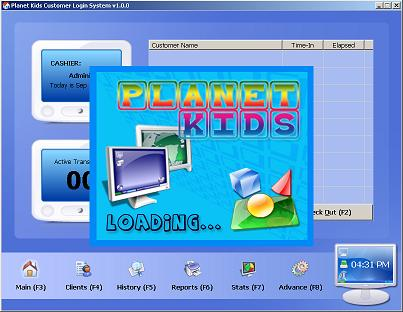



## A Planet Kids Customer Login System

### Description

Hi everyone! It's me, author of Award Winning dcButton. Sorry I didn't have the chance to update the control, but soon I will after I finish my works. One of them is this small program that simply monitors customer's time in and out (Ex. a child left by mom to play while she go shopping); I wanted everyone to test it coz in a few days it'll be released to the establishment who will use it. I want it to be bug-free before that so please help me. It's not well commented but I'm sure many will learn from this; like how to create very good looking, flexible, and user-friendly interface w/o using custom controls, support standard and serial barcode scanners, use mscharts, backup and restore msaccess databases w/o closing the whole application, temporarily change screen resolution to launch program in fullscreen, support xp styles using resourced manifest file, protect external image files from simple copying, and many many more. Please vote and leave some comments for me. Btw, Pinoy ako, and I'm proud to say that.
 
### More Info
 

             |
---                |---
**Submitted On**   |2006-09-14 04:40:44
**By**             |[Noel Dacara](https://github.com/Planet-Source-Code/PSCIndex/blob/master/ByAuthor/noel-dacara.md)
**Level**          |Intermediate
**User Rating**    |4.5 (67 globes from 15 users)
**Compatibility**  |VB 5\.0, VB 6\.0, VBA MS Access
**Category**       |[Complete Applications](https://github.com/Planet-Source-Code/PSCIndex/blob/master/ByCategory/complete-applications__1-27.md)
**World**          |[Visual Basic](https://github.com/Planet-Source-Code/PSCIndex/blob/master/ByWorld/visual-basic.md)
**Archive File**   |[A\_Planet\_K2019799142006\.zip](https://github.com/Planet-Source-Code/noel-dacara-a-planet-kids-customer-login-system__1-66559/archive/master.zip)

